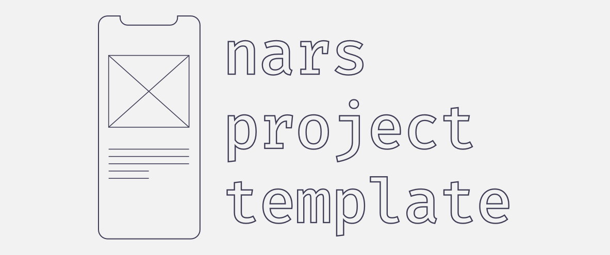

<p align="center">
  
</p>
<h3 align="center">
  Full stack React Native template for greenfield <a href="https://github.com/nars-dev/nars">nars</a> projects
</h3>

# 🚀 Usage

**⚠️ The new `@react-native-community/cli` is required ⚠️**

```
npx react-native init MyApp --template https://github.com/nars-dev/template.git
```

See `react-native init --help` for more options.

# 📃 License

This project is MIT licensed.

# 👾 Community

Visit [nars discord](https://discord.gg/ubsun8r) to get help!
